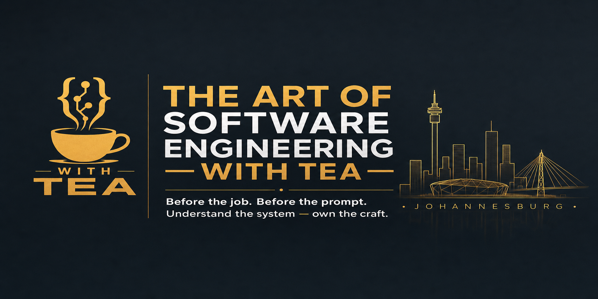

### Hi, I'm Thabiso Xulu 👋

**Builder · Software engineer · Founder · Host of The Art of Software Engineering — with Tea**

I build real systems for South Africa — and I teach people how to **think like engineers**, not only how to write syntax.

> Before the job. Before the prompt. Understand the system — own the craft.

---

**Stack:** `Elixir` · `Phoenix` · `Python` · `Flutter` · `PostgreSQL` · `Rust`

---

#### Currently
- Building **[StudentPlug](https://github.com/ThabisoX/StudentPlug)** — multi-surface student platform (StudentJunxion)
- Hosting weekly: **Mon Foundations · Wed The Table · Fri Build**
- Learning path: Assembly → C → systems → production
- Based in Johannesburg, South Africa

#### Featured
| Project | Link |
|---------|------|
| StudentPlug | https://github.com/ThabisoX/StudentPlug |
| StreamGen | https://github.com/ThabisoX/StreamGen |
| Live product | https://studentjunxion.co.za |

---

*You don't have to learn alone.*  
**— with Tea —**
